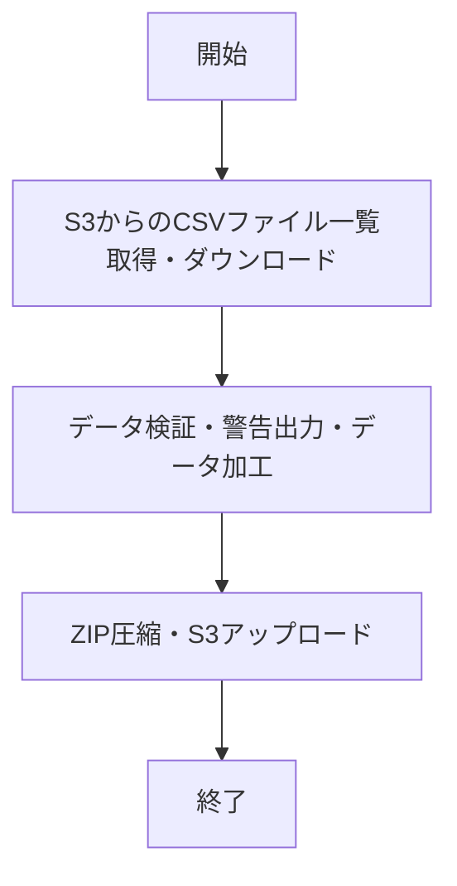
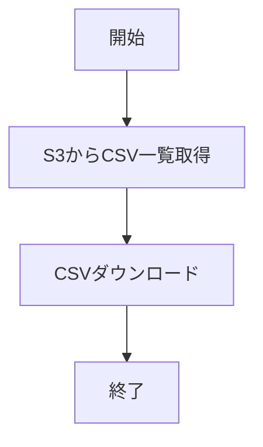
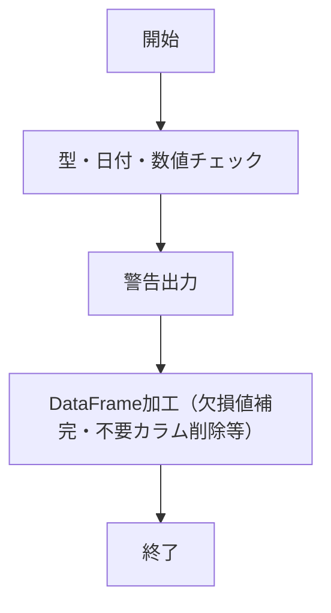
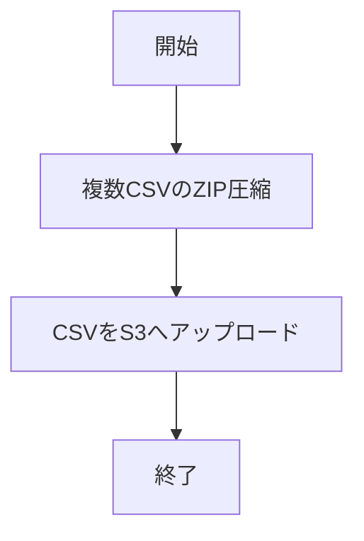

# 機能全体設計書A


## 1. システム概要
本システムは、AWS S3バケットからCSVファイルをダウンロードし、データの検証・加工を行い、再度S3へアップロードするバッチ処理を提供します。主な処理はPythonスクリプトで実装されています。

## 2. 処理フロー図



## 3. 機能一覧
1. S3からのCSVファイル一覧取得・ダウンロード
2. データ検証・警告出力・データ加工
3. ZIP圧縮・S3アップロード
4. 複数CSVのZIP圧縮

## 4. 各機能の詳細

本設計では、関連する機能をまとめて記載しています。
- エラーメッセージやバリデーションメッセージは modules/messages.py で一元管理され、各モジュール（box_upload.py, check_process.py, s3_download.py, s3_upload.py）から参照されます。
  これにより、例外発生時のメッセージが各モジュールで統一され、保守性が向上します。
  例：
  modules/messages.py
  ```python
  # 共通メッセージ定義
  MESSAGES = {
      'file_path_none': 'file_path is None',
      'file_path_empty': 'file_path is empty',
      'file_not_found': '{file_path} does not exist',
      'box_config_missing': 'BOX_CONFIG_PATH is not set or file does not exist',
      'columns_file_none': 'columns_file is None',
      'columns_file_empty': 'columns_file is empty',
      'columns_file_invalid': 'invalid format in columns_file',
      'bucket_invalid': 'bucket must be a non-empty string',
      'key_invalid': 'key must be a non-empty string',
      'local_s3_dir_invalid': 'local_s3_dir must be a non-empty string',
      'csv_dir_none': 'csv_dir is None',
      'csv_dir_empty': 'csv_dir is empty',
      'zip_path_empty': 'zip_path is empty',
  }
  ```

### 4.1 入出力ファイルの仕様
- 入力ファイルは「グループ名/日付_時分.csv」とし、出力ファイルは「日付_グループ名.csv」でグループごとにまとめて出力するように仕様変更。
  - 例: 入力ファイルパス test/2025-06-12_9000.csv, test/2025-06-12_9001.csv, test1/2025-06-12_9000.csv, ...
  - 例: 出力ファイル名 2025-06-12_test.csv, 2025-06-12_test1.csv


### 4.2 S3からのCSVファイル一覧取得・ダウンロード

- 指定バケット・プレフィックス・日付でCSVファイルをリストアップし、対象CSVをダウンロードする
  - `s3_download.py` の `list_csv_files` 関数は、指定したバケット・プレフィックス・日付に該当するCSVファイルの一覧をS3から取得します。
  - `download_csv` 関数は、指定したS3オブジェクト（CSVファイル）をローカルディレクトリにダウンロードします。
  - いずれもboto3クライアントを利用し、ファイル名に日付が含まれるCSVのみを対象とします。
  - 本処理では、複数ファイルのダウンロードを高速化するために`joblib`の`Parallel`および`delayed`を用いた並列処理を実装しています。これにより、複数のCSVファイルを同時にダウンロード可能です。

### 4.3 データ検証・警告出力・データ加工



- columns.txtで定義された型情報に基づき、各カラムの型チェックや日付型・数値型の不正値検出、警告出力を行い、必要に応じてDataFrameの加工処理（例：欠損値補完、不要カラム削除等）を実施します。
- `check_process.py` の `check_values` 関数は、DataFrameとカラム型情報（columns.txtで定義）を受け取り、各カラムの型チェックや日付・数値型の不正値検出を行います。
- 不正値や空文字、NULL（NaN, None等）が検出された場合の処理、ワーニング出力内容は下表の通りです。

| チェック内容         | エラー/空文字/NULL時の処理         | ワーニング出力内容例                       |
|----------------------|-------------------------------------|--------------------------------------------|
| 日付型 (datetime)    | 不正値・空文字・NULLは空文字に置換  | Invalid datetime in {col} at row {i}: {v}  |
| 浮動小数点 (float)   | 不正値・空文字・NULLは空文字に置換  | Invalid float in {col} at row {i}: {v}     |
| 整数型 (int)         | 不正値・空文字・NULLは空文字に置換  | Invalid int in {col} at row {i}: {v}       |
| 文字列型 (str)       | None/NULLは空文字に補完             | なし（警告出力なし）                       |
| 不要カラム           | DataFrameから削除                   | なし                                       |

- ワーニングはリスト形式で返却され、各行・カラムごとに不正値が検出された場合に出力されます。
- 欠損値（NaN, None等）は全カラムで空文字に補完されます。
- columns.txtに含まれないカラムはDataFrameから削除されます。
- 本処理では、複数ファイルのデータ検証・加工を効率的に行うため、`joblib`の`Parallel`および`delayed`を用いた並列処理を実装しています。これにより、複数のCSVファイルの検証・加工を同時に実行できます。

#### columns.txtの定義内容と使用方法
- columns.txtには、CSVファイルの各カラム名とそのデータ型を「カラム名:型」の形式で1行ずつ記載します。
  例:
    datetime:datetime
    value1:float
- サポートされる型は、datetime, float, int, str などです。
- 本ファイルはデータ検証処理で参照され、各カラムの型チェックや不正値検出に利用されます。
- columns.txtのパスは.envファイルのCOLUMNS_FILEで指定します。

### 4.4 ZIP圧縮・S3アップロード

- 複数CSVファイルをZIP形式でまとめて、S3へアップロードする
  - `s3_upload.py` の `zip_csv_files` 関数は、指定ディレクトリ内の複数CSVファイルをまとめてZIP圧縮します。
  - `upload_csv` 関数は、単一CSVまたはZIPファイルをS3バケットへアップロードします。
  - いずれもboto3クライアントを利用し、アップロード先バケット・キーは引数で指定します。
- box_upload.py, check_process.py, s3_download.py, s3_upload.py では、エラーやバリデーション例外時のメッセージとして modules/messages.py の定義を利用します。

## 5. ディレクトリ構成
- script.py: メインバッチスクリプト
- s3_download.py: S3からのダウンロード関連
- s3_upload.py: S3へのアップロード・ZIP圧縮関連
- check_process.py: データ検証処理
- columns.txt: カラム名と型定義
- modules/messages.py: 共通エラーメッセージやバリデーションメッセージの定義ファイル。
- test_*.py: 各種ユニットテスト

## 6. 環境変数
- 下記の環境変数を定義します。

| 変数名         | 説明                                 |
|----------------|--------------------------------------|
| SRC_BUCKET     | 入力元S3バケット名                   |
| SRC_PREFIX     | 入力元S3プレフィックス（ディレクトリ）|
| DATE           | 対象日付（例: 20240601）             |
| DOWNLOAD_DIR   | ダウンロード先ディレクトリ           |
| COLUMNS_FILE   | columns.txtのパス                    |
| CHECKED_DIR    | 検証済みデータの出力ディレクトリ     |
| DST_BUCKET     | 出力先S3バケット名                   |
| DST_KEY        | 出力先S3キー（ファイル名/パス）      |

- 例: columns.txtのパスはCOLUMNS_FILEで指定します。

- .envファイルでAWS_ACCESS_KEY_IDとAWS_SECRET_ACCESS_KEYを指定します。

| 変数名                | 説明                                 |
|-----------------------|--------------------------------------|
| AWS_ACCESS_KEY_ID     | AWSアクセスキー                      |
| AWS_SECRET_ACCESS_KEY | AWSシークレットキー                  |

---
2025年6月11日 作成
