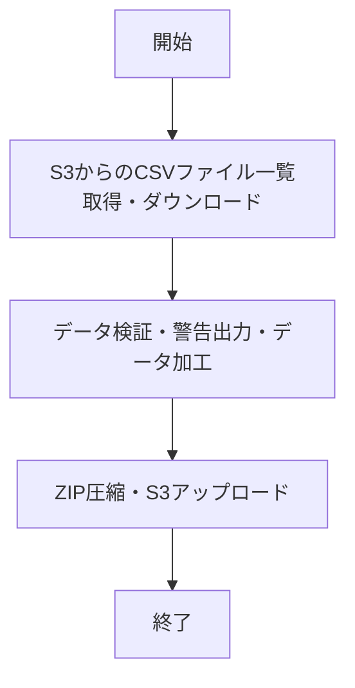
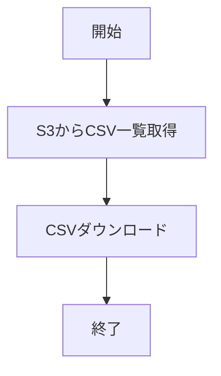
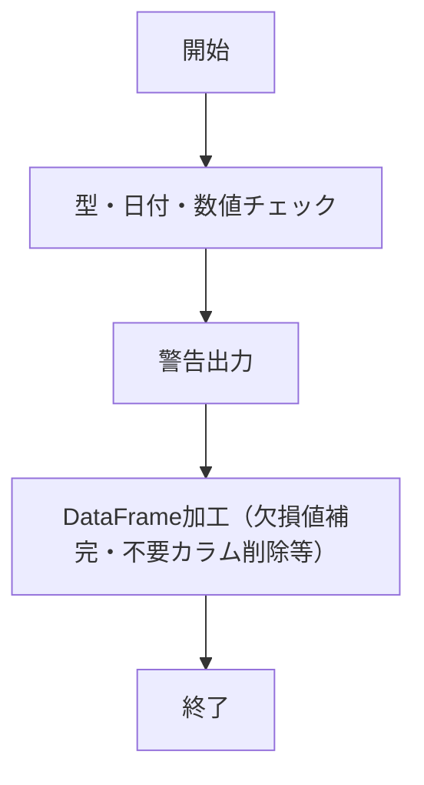
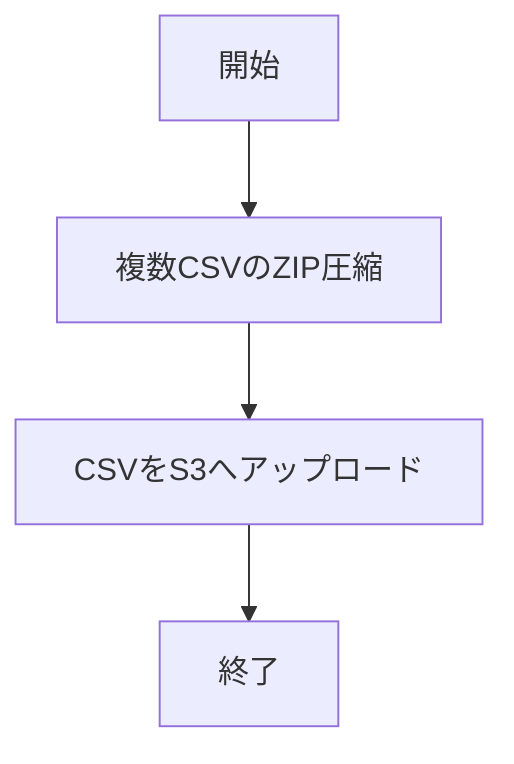

# 機能全体設計書

## 1. システム概要
本システムは、AWS S3バケットからCSVファイルをダウンロードし、データの検証・加工を行い、再度S3へアップロードするバッチ処理を提供します。主な処理はPythonスクリプトで実装されています。

## 2. 処理フロー図

## 3. 機能一覧
1. S3からのCSVファイル一覧取得・ダウンロード
2. データ検証・警告出力・データ加工
3. ZIP圧縮・S3アップロード
4. 複数CSVのZIP圧縮

## 4. 各機能の詳細

本設計では、関連する機能をまとめて記載しています。

### 4.1 S3からのCSVファイル一覧取得・ダウンロード

- 指定バケット・プレフィックス・日付でCSVファイルをリストアップし、対象CSVをダウンロードする
  - `s3_download.py` の `list_csv_files` 関数は、指定したバケット・プレフィックス・日付に該当するCSVファイルの一覧をS3から取得します。
  - `download_csv` 関数は、指定したS3オブジェクト（CSVファイル）をローカルディレクトリにダウンロードします。
  - いずれもboto3クライアントを利用し、ファイル名に日付が含まれるCSVのみを対象とします。

### 4.2 データ検証・警告出力・データ加工

- columns.txtで定義された型情報に基づき、各カラムの型チェックや日付型・数値型の不正値検出、警告出力を行い、必要に応じてDataFrameの加工処理（例：欠損値補完、不要カラム削除等）を実施
  - `check_process.py` の `check_values` 関数は、DataFrameとカラム型情報（columns.txtで定義）を受け取り、各カラムの型チェックや日付・数値型の不正値検出を行います。
  - 不正値が検出された場合は警告リストに追加し、必要に応じてDataFrame上の該当値を空文字等に置換します。
  - 欠損値補完や不要カラム削除などの加工処理も本関数で実施します。

#### columns.txtの定義内容と使用方法
- columns.txtには、CSVファイルの各カラム名とそのデータ型を「カラム名:型」の形式で1行ずつ記載します。
  例:
    datetime:datetime
    value1:float
- サポートされる型は、datetime, float, int, str などです。
- 本ファイルはデータ検証処理で参照され、各カラムの型チェックや不正値検出に利用されます。
- columns.txtのパスは.envファイルのCOLUMNS_FILEで指定します。

### 4.3 ZIP圧縮・S3アップロード

- 複数CSVファイルをZIP形式でまとめて、S3へアップロードする
  - `s3_upload.py` の `zip_csv_files` 関数は、指定ディレクトリ内の複数CSVファイルをまとめてZIP圧縮します。
  - `upload_csv` 関数は、単一CSVまたはZIPファイルをS3バケットへアップロードします。
  - いずれもboto3クライアントを利用し、アップロード先バケット・キーは引数で指定します。

## 5. ディレクトリ構成
- script.py: メインバッチスクリプト
- s3_download.py: S3からのダウンロード関連
- s3_upload.py: S3へのアップロード・ZIP圧縮関連
- check_process.py: データ検証処理
- columns.txt: カラム名と型定義
- test_*.py: 各種ユニットテスト

## 6. 環境変数
- .envファイルでS3バケット名、プレフィックス、日付、ダウンロードディレクトリ等を指定します。
- 下記の環境変数を.envファイルで定義します。

| 変数名         | 説明                                 |
|----------------|--------------------------------------|
| SRC_BUCKET     | 入力元S3バケット名                   |
| SRC_PREFIX     | 入力元S3プレフィックス（ディレクトリ）|
| DATE           | 対象日付（例: 20240601）             |
| DOWNLOAD_DIR   | ダウンロード先ディレクトリ           |
| COLUMNS_FILE   | columns.txtのパス                    |
| CHECKED_DIR    | 検証済みデータの出力ディレクトリ     |
| DST_BUCKET     | 出力先S3バケット名                   |
| DST_KEY        | 出力先S3キー（ファイル名/パス）      |

- 例: columns.txtのパスはCOLUMNS_FILEで指定します。

---
2025年6月11日 作成
